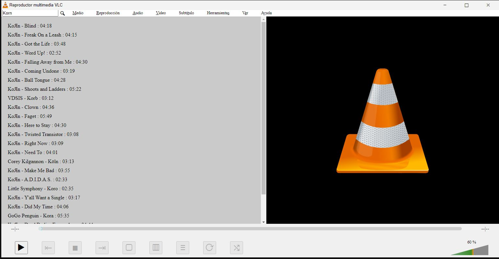

# VLC Replica
> Este es una réplica del reproductor multimedia VLC desarrollada con tecnologías web utilizando React, TypeScript y la API de Deezer.
> Permite a los usuarios reproducir una variedad de formatos de medios desde la plataforma Deezer de manera conveniente a través de sus navegadores web.

## Características
- Reproducción de una amplia gama de canciones y pistas de audio desde la plataforma Deezer.
- Interfaz de usuario intuitiva y fácil de usar, inspirada en el reproductor VLC original.
- Controles de reproducción estándar, como reproducción, pausa, avance rápido, retroceso rápido y ajuste de volumen.
- Soporte para la visualización de información de la canción en reproducción, como título, artista y carátula del álbum.
- Posibilidad de buscar y seleccionar canciones específicas de Deezer para reproducirlas.
- Diseño receptivo que se adapta a diferentes tamaños de pantalla y dispositivos.
  

## Tecnologías Utilizadas:
&nbsp;
&nbsp;
&nbsp;
&nbsp;
&nbsp;

## Contacto

Si tienes alguna pregunta o comentario, no dudes en ponerte en contacto:

